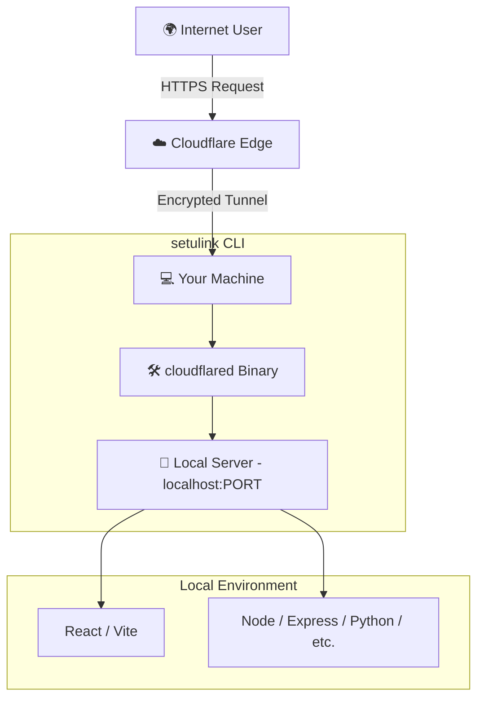

# ☁️ setulink

**setulink** is a powerful Node.js CLI tool that breathes life into your local development environment by securely exposing your local servers to the internet using **Cloudflare Tunnels**. No more port forwarding, no more "blank page" security blocks, and no more manual configuration.

---

## 🏗 How it Works (Architecture)

`setulink` acts as a bridge between your local machine and the global Cloudflare network. It leverages the `cloudflared` engine to create a persistent, encrypted tunnel.



---

## ✨ Features

- 🔦 **Smart Auto-Port Detection**: Automatically scans your system for active ports (3000-6000) and lets you choose which one to expose.
- ⚡ **Vite-Specific Optimization**: Detects Vite projects and automatically configures `host`, `allowedHosts`, and `HMR` for a seamless remote experience.
- 📅 **Session Summary**: Get a neat report on exit showing your session duration and the URL history.
- 🔒 **Secure by Default**: Uses Cloudflare's enterprise-grade infrastructure. No local password bypasses required.
- 🚀 **Zero Config**: Just run it, select your port, and share your link.

---

## 📁 File Structure

```text
setulink/
├── bin/
│   └── index.js           # Main CLI entry point (Port scanning, Logic, Summary)
├── src/
│   ├── tunnel.js          # Cloudflare Tunnel lifecycle management
│   ├── detectVite.js      # Vite project detection logic
│   ├── updateViteConfig.js # Automatic Vite configuration helper
│   ├── prompt.js          # Interactive user input (prompts, selections)
│   └── logger.js          # Styled terminal output (Chalk + Ora)
├── node_modules/          # Dependencies (cloudflared, commander, etc.)
└── package.json           # Project metadata and CLI registration
```

---

## 🛠 Technical breakdown

### 1. Port Discovery
The CLI uses a concurrent scanning algorithm to check for active listeners on `localhost` between ports `3000` and `6000`. If multiple servers are found (e.g., a React frontend and a Node backend), it provides an interactive menu.

### 2. Tunneling Engine
Under the hood, `setulink` spawns a `cloudflared` process using the `Tunnel.quick()` API. This creates a secure tunnel to the Cloudflare edge and yields a unique `*.trycloudflare.com` URL.

### 3. Vite Synchronization
Since Vite 6+ has strict host and security requirements, `setulink` offers to inject the following into your `vite.config.js`:
- `server.host: true`: Required for external tunnel access.
- `server.allowedHosts: true`: To permit the Cloudflare domain.
- `server.hmr.clientPort: 443`: To ensure Hot Module Replacement works over the HTTPS tunnel.

---

## 🚀 Usage

### Installation

**From npm (Global):**
```bash
npm install -g setulink@latest
```

**Using npx (No Installation Required):**
```bash
npx setulink@latest
```

**From Source:**
Clone the repository and link it locally:
```bash
npm install
npm link
```

### Running the App
**Auto-detect and start:**
```bash
setulink
```

**Expose a specific port:**
```bash
setulink --port 4000
```

**Debug connection issues:**
```bash
setulink --debug
```

### Exit
Press `Ctrl + C` to shut down the tunnel. You will see a summary of your session:
```text
🔒 Tunnel closed
⏱ Session duration: 15m 20s
🌍 URL was: https://awesome-project.trycloudflare.com
```

---
*Created with ❤️ for developers who want to share their work instantly.*
